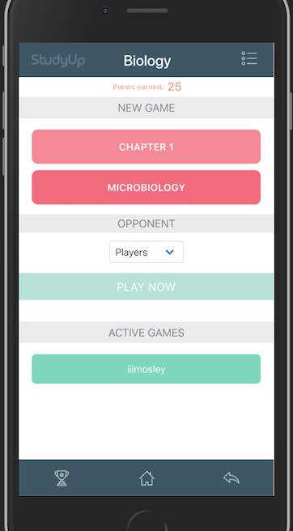
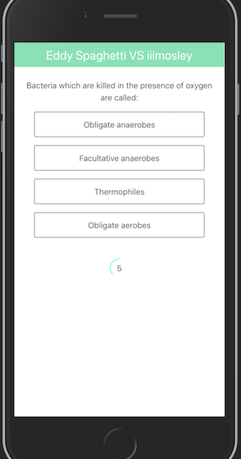
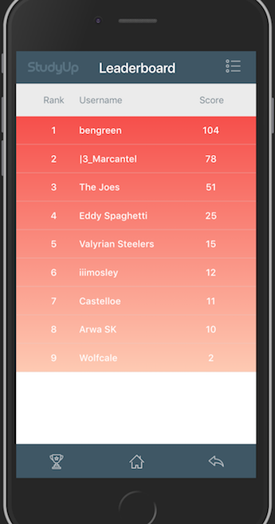

# StudyUp

Concept educational app that allows students to challenge one another with trivia-style quizzes.

Built with Node.js and Express. Realtime interaction with Socket.IO



## Local Installation:

To get the application up and running on your machine, you'll need to have the following installed on your system:

* [npm](https://www.npmjs.com/)
* [node.js](https://nodejs.org/en/)
* [Postgres](https://postgresql.org/) _requires an account_

Then follow these steps:

1.  Fork and clone the repo onto your machine `https://github.com/hunterphillips/StudyUp.git`
2.  CD into the project folder directory and run `npm install` to download the required dependencies
3.  Add a directory and file titled `config` in the server directory:

```
 {
        "development": {
          "username": "your username here",
          "password": "your password here",
          "database": "final-wrkout",
          "dialect": "postgres"
        },
        "test": {
          "username": "root",
          "password": null,
          "database": "database_test",
          "host": "127.0.0.1",
          "dialect": "mysql"
        },
        "production": {
          "username": "root",
          "password": null,
          "database": "database_production",
          "host": "127.0.0.1",
          "dialect": "mysql"
        }
      }
```

4.  Initialize the database `node build-db.js`
5.  In your terminal run `npm run dev`

### Game Example:

 

## Built With

* [Node.js](https://nodejs.org/) - Open-source JavaScript run-time environment that executes JavaScript code server-side
* [Express](https://expressjs.com/) - Web Application framework for building web and mobile applications with Node.js
* [Postgres](https://postgresql.org/) - Object-relational database management system
* [Sequelize](http://docs.sequelizejs.com/) - Promise-based ORM for Node.js
* [Socket.IO](https://socket.io/) - JavaScript library for realtime communication between web clients and servers
* [AngularJS](https://angularjs.org/) - Javascript front-end web framework
* [Bulma](https://bulma.io/) - Open source CSS framework based on Flexbox

## Credits

* Socrative App (database): <https://www.socrative.com/> - Super cool app for educators to track student progress and access an open-souce library of quizzes and study guides based on individual chapters up to cummulative exams.

* Yaphi Berhanu [JavaScript Quiz](https://www.sitepoint.com/author/yberhanu/)

* [NSS](http://nashvillesoftwareschool.com/) - Web development program in Nashille, TN.
